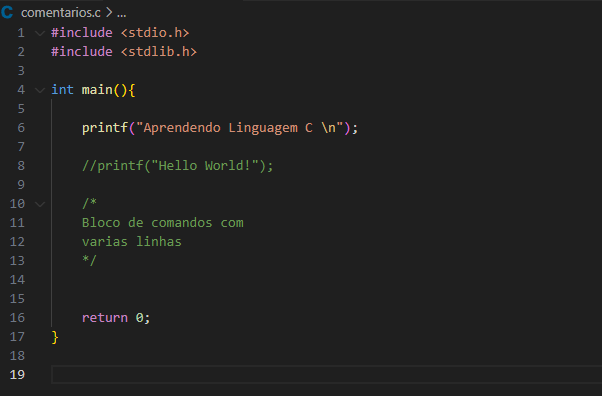
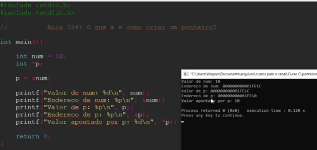

# Linguagem C

# Características Linguagem C

1. **Simplicidade**: Possui uma sintaxe simples e direta, facilitando o entendimento e a escrita do código.
2. **Linguagem estruturada**: Permite organizar o código em **funções e módulos**, facilitando a manutenção e reutilização.
3. **Portabilidade**: Programas escritos em C podem ser executados em diferentes plataformas com pouca ou nenhuma modificação.
4. **Acesso a baixo nível**: Permite manipulação direta de memória, ponteiros e recursos de hardware, sendo adequada para desenvolvimento de sistemas operacionais e drivers.
5. **Eficiência e desempenho**: Os programas em C geralmente apresentam excelente desempenho, pois a linguagem foi projetada para ser eficiente em termos de uso de memória e velocidade de execução.
6. **Linguagem compilada**: O código fonte é convertido para código de máquina por um compilador, gerando executáveis rápidos.
7. **Biblioteca padrão reduzida**: Oferece uma biblioteca padrão pequena, incentivando os programadores a escreverem suas próprias funções para tarefas específicas.
8. **Tipagem estática**: O tipo das variáveis é definido em tempo de compilação, ajudando a evitar certos tipos de erros.
9. **Modularidade**: O código pode ser dividido em múltiplos arquivos e módulos, facilitando a organização em projetos maiores.
10. **Extensibilidade**: Pode ser estendida por meio de bibliotecas e funções criadas pelo próprio programador.

# Diferença Linguagem Estruturada x OO

A principal diferença entre uma linguagem estruturada e uma linguagem orientada a objetos (OO) está na forma como elas organizam e modelam o código e os dados:

## **Linguagem Estruturada**

- **Foco em funções/procedimentos:** O código é organizado em funções ou procedimentos, que recebem dados como parâmetros e retornam resultados.
- **Fluxo de controle:** Utiliza estruturas de controle como if, for, while para controlar o fluxo do programa.
- **Dados e funções separados:** Os dados (variáveis, estruturas) e as funções (lógicas) são separados.
- **Exemplo:** Linguagens como C, Pascal, Fortran.

**Exemplo em C (estruturada):**

```c
struct Pessoa {
    char nome[50];
    int idade;
};

void imprimePessoa(struct Pessoa p) {
    printf("%s tem %d anos\n", p.nome, p.idade);
}
```

---

## **Linguagem Orientada a Objetos (OO)**

- **Foco em objetos:** O código é organizado em objetos, que são instâncias de classes.
- **Encapsulamento:** Dados e métodos relacionados ficam juntos dentro de uma classe.
- **Herança:** Possibilidade de criar novas classes baseadas em outras.
- **Polimorfismo:** Mesma interface pode ter diferentes implementações.
- **Exemplo:** Linguagens como Java, C++, Python (com OO), C#.

**Exemplo em Java (OO):**

```java
class Pessoa {
    String nome;
    int idade;

    void imprimePessoa() {
        System.out.println(nome + " tem " + idade + " anos");
    }
}
```

---

## **Resumindo**

- **Estruturada:** Organiza o código em funções/procedimentos. Dados e funções são separados.
- **Orientada a Objetos:** Organiza o código em objetos (dados + funções juntos). Usa conceitos como encapsulamento, herança e polimorfismo.

# Printando e Comentários



Para imprimir na tela uso **PRINTF** é um tipo de print formato

```c
int numero = 10; 

printf("%d", &numero);//saida - 10 
/* 
%d — inteiro (int)
%f — decimal/ponto flutuante (float ou double)
%c — caractere (char)
%s — string (char[])	
*/
```

# Scaneando valores

### **1. Lendo um número inteiro**

```c
int numero;
printf("Digite um número: ");
scanf("%d", &numero);
```

### 2. Lendo um número decimal (float)

```c
float valor;
printf("Digite um valor decimal: ");
scanf("%f", &valor);
```

### **3. Lendo um caractere**

```c
char letra;
printf("Digite uma letra: ");
scanf(" %c", &letra); // note o espaço antes de %c para ignorar espaços em branco anteriore
```

### 4. Lendo uma frase (sem espaço)

```c
 char palavra[50]; // Vetor de char para armazenar a palavra (até 49 letras + '\0')

 printf("Digite uma palavra: ");
 scanf("%s", palavra); // Lê até o primeiro espaço

```

### 5. **Lendo uma linha/frase (com espaços)**

```c
char frase[100];
printf("Digite uma frase: ");
scanf(" %[^\n]", frase); // lê até encontrar '\n' enter
```

## Scanf de String

String em C nada mais é do que um array de caracteres, isso explica porque não é preciso usar & no meu scan, porque minha string ja funciona como um ponteiro, ela aponta para o primeiro (variavel[0]) do vetor

A variável de array de char (string) é um ponteiro para a primeira posição do array

```c
 char palavra[100];

    printf("Digite uma frase: ");
    scanf("%100[^\n]", palavra);
    
    printf("Frase: %s", palavra); //saida vai ser o que o usuario digitar
    printf("%p", &palavra);//saida vai ser o endereco do vetor na posicao [0]
    printf("%p", palavra);//saida vai ser o mesmo endereço [0]
    printf("%p", &palavra[0]);//saida vai ser o mesmo endereço [0]
```

## **Dicas importantes:**

- Sempre use o **&** (endereço) para variáveis que **não são arrays** (como `int`, `float`, `double`, `char`).
- Para strings (arrays de char), **não** use o &.
- Para ler frases (com espaços), use `" %[^\n]"` como forma segura.
- Cuidado com o buffer: ao misturar diferentes tipos de leitura (`%d`, `%f`, `%c`, `%s` e `%[^\n]`), pode ser necessário limpar o buffer (com `getchar()` ou um espaço antes do formato do `scanf`).

# Ponteiro

## O que é um ponteiro

- Um ponteiro é uma variável que armazena um **endereço de memória.** Como se fosse uma seta, ela aponta para um endereço
- **Ponteiro só armazena endereços de memória**
    - Pode armazenar de varios tipos
- Ponteiro só armazena **um endereço de memória**

### Funciona com todos os tipos?

- Em C, ponteiros funcionam com **qualquer tipo de dado**, incluindo tipos primitivos (como int, float, char) e tipos compostos, como structs, arrays e também strings.
- **No contexto da linguagem C, uma "string" nada mais é do que um array de caracteres (`char`).** Portanto, um ponteiro para string é, na verdade, um ponteiro para `char`.
- Por exemplo:

```c
char *str = "Olá, mundo!";
```

### Criando variável comum

```c
int num = 10; //Criando variável comum do tipo int
printf("Valor da variável num: %d", num); //vai imprimir 10
printf("Endereço da variável num: %p", &num); //saida - um endereço de memoria
// tipo 061FE1
```

- Obter endereço de memória de uma variável - com scanf
- &nomeVariavel - o & vai servir para trazer o endereço de memória da variável

### Criando ponteiro

```c
int *p; //o * diz que p é um ponteiro para um endereço na memoria do tipo inteiro
p = &num; //não posso fazer p = num pq eu estaria armazenando o valor da variavel num q é 10, e em um ponteiro eu só posso armazenar um endereço de memória

// pode fazer também a atribuição de uma valor ao ponteiro 
*p = 10; 
```

### Na prática:



- P (ponteiro) Aponta para o **endereço de memória** uma variável, tem seu **próprio endereço** e **aponta pra um valor**
- Quando faço printf("Valor de p: %p", p);
    - estou imprimindo o valor de P (que é o endereço associado a ele, ou seja o endereço da variável num)
    - **Uso apenas p**
- Quando faço printf(”Endereço de p: %p”, &p);
    - Estou imprimindo o endereço do ponteiro
    - Tenho que usar &p para indicar que quero o endereço do ponteiro, não o valor do ponteiro
- Quando faço printf(”Valor apontado por P: %p”, *p);
    - Estou imprimindo o valor apontado por p, ou seja, 10
    - Tenho que usar *p para dizer q é o valor apontado por p.
- Resumindo
    - *p - **valor apontado por p**
    - &p - **endereço de memória de P**
    - p - **valor de p (endereço de memória daquela variável para qual p aponta)**

## Quanto de memória ocupa um ponteiro

- Como o ponteiro é um **endereço de memória**, não importa o **tipo**(int,char, float) ele sempre vai ter o mesmo tamanho (8 bytes)

```c
int *p;
int num;
printf("Tamanho memória variável: %d", sizeof(int)); //saida - 4
printf("Tamanho memória ponteiro: %d", sizeof(p)); //saida - 8 
```

# Estruturas: for, while, if, switch case

## For

```c
for (inicialização; condição; incremento) {
    // bloco de código a ser executado
}

for (i = 1; i <= 5; i++) {
        printf("%d\n", i);
    }
```

### Exemplo prático: Tabuada

```c
#include <stdio.
#include <stdlib . h»
int
int num;
printf("Digite um numero:
&num);
for(int i = e; i < II;
printf("%d x Xd = %d\n",
num,
return e;
i,
(num*i));
```

## IF ELSE

```c
if (condição) {
    // bloco se condição for verdadeira
} else if (outra_condicao) {
    // bloco se outra condição for verdadeira
} else {
    // bloco se nenhuma das condições anteriores for verdadeira
}
```

```c
#include <stdio.h>

int main() {
    int numero = 10;
    if (numero > 0) {
        printf("O número é positivo.\n");
    } else if (numero < 0) {
        printf("O número é negativo.\n");
    } else {
        printf("O número é zero.\n");
    }
    return 0;
}
```

## While

```c
while (condição) {
    // bloco de código repetido enquanto condição for verdadeira
}
```

Exemplo prático

```c
#include <stdio.h>

int main() {
    int i = 1;
    while (i <= 5) {
        printf("%d\n", i);
        i++;
    }
    return 0;
}
```

## Do While

```c
do {
    // bloco de código executado pelo menos uma vez
} while (condição);
```

Exemplo prático

```c
#include <stdio.h>

int main() {
    int i = 1;
    do {
        printf("%d\n", i);
        i++;
    } while (i <= 5);
    return 0;
}
```

## Switch case

```c
switch (variavel) {
    case valor1:
        // bloco para valor1
        break;
    case valor2:
        // bloco para valor2
        break;
    default:
        // bloco se nenhum caso for satisfeito
}
```

Exemplo prático

```c
#include <stdio.h>

int main() {
    int dia = 3;
    switch (dia) {
        case 1:
            printf("Domingo\n");
            break;
        case 2:
            printf("Segunda-feira\n");
            break;
        case 3:
            printf("Terça-feira\n");
            break;
        default:
            printf("Outro dia\n");
    }
    return 0;
}
```

# Estrutura de dados em C: vetores

### Criando um vetor

```c
int inteiros[3];  //criando vetor estabelecendo seu tamanho
int numeros [] = {1, 5, 9}; //armazenando valores diretamente
int inteiros[5] = {1, 5, 9}; //vetor criado com tamanho 5 ja com valores, com 2 posições com valor 0

```

### Percorrendo um vetor

```c
int numeros[] = {1, 5, 9, 15, 43}; //criando vetor de inteiros
printf("Vetor de inteiros:\n");
    for (int i = 0; i < 5; i++) { //imprimindo vetor de inteiros
        printf("%d ", numeros[i]);
    }
    printf("\n");
 int tam_numeros = sizeof(numeros) / sizeof(numeros[0]); // descobrindo tamanho 
 // de um vetor estatico (não tem o length)
    
    
// vetor de char (string)

 char vogais[] = {'a', 'e', 'i', 'o', 'u'};
    int tam_vogais = sizeof(vogais) / sizeof(vogais[0]);
    printf("Vetor de vogais:\n");
    for (int i = 0; i < tam_vogais; i++) {
        printf("%c ", vogais[i]);
    }
    printf("\n");
    
 // vetor de floats
  float notas[] = {7.5, 8.0, 9.2};
    int tam_notas = sizeof(notas) / sizeof(notas[0]);
    printf("Vetor de notas:\n");
    for (int i = 0; i < tam_notas; i++) {
        printf("%.2f ", notas[i]);
    }
    printf("\n");

```

### **Como criar um vetor de diferentes tipos em C**

Em C, um vetor (array) tradicional só pode armazenar um único tipo de dado (ex: só `int`, só `float` etc). Para armazenar diferentes tipos, você pode usar uma `struct`:

```c
#include <stdio.h>

typedef struct {
    int inteiro;
    float decimal;
    char letra;
} Elemento;

int main() {
    Elemento vetor[3];

    vetor[0].inteiro = 10;
    vetor[0].decimal = 3.14;
    vetor[0].letra = 'A';

    // Acessando os valores
    printf("Inteiro: %d, Decimal: %.2f, Letra: %c\n", vetor[0].inteiro, vetor[0].decimal, vetor[0].letra);

    return 0;
}
```

## Preenchendo vetores

 

```c
int numeros[5];

for (int i = 0; i < 5; i++){
		printf("\nDigite o número da posição %d:", i);
		scanf("%d", &numeros[i]);
}
```

## Preenchendo vetores com numeros aleatorios

```c
int numeros[5];

srand(time(NULL)); //dizendo para começar sempre de uma valor diferente 
//(garante que toda vez q executar o primeiro vai ser difernte)

for (int i = 0; i < 5; i++){
		numeros[i] = rand();
}

//gerando numeros aleatorios dentro de um intervalo 
for (int i = 0; i < 5; i++){
		numeros[i] = rand() % 100; //vai de 0 a 99
}

//caso queira começar do 1 
numeros[i] = 1 + rand() % 99;
```

# Alocação de memória

### **Alocação dinâmica de memória com a função MALLOC**

- Retorna um ponteiro para a região de memória alocada ou NULL

A alocação de memória em C refere-se ao processo de **reservar espaço na memória RAM para armazenar dados durante a execução de um programa.** Existem dois tipos principais de alocação de memória em C:

1. **Alocação Estática**
- A memória é reservada em **tempo de compilação.**
- Variáveis declaradas fora de funções ou com o modificador static permanecem na memória durante **todo o tempo de execução do programa.**
- Exemplo: int x; ou static int y; lembrar* um inteiro ocupa 4 bytes de memória
1. **Alocação Dinâmica**
- A memória é reservada em **tempo de execução.**
- **Utiliza funções da biblioteca stdlib.h:**
    - **malloc():** aloca um bloco de memória de tamanho especificado.
    - **calloc():** aloca um bloco de memória para um certo número de elementos, inicializando-os com zero.
    - **realloc():** redimensiona um bloco de memória previamente alocado.
    - **free():** libera a memória previamente alocada.

## Função MALLOC

```c
#include <stdio.h>
#include <stdlib.h>

int main() {
    int *ptr;
    ptr = (int*) malloc(5 * sizeof(int)); // aloca espaço para 5 inteiros

    if (ptr == NULL) {
        printf("Falha na alocação de memória.\n");
        return 1;
    }

    // Uso da memória alocada
    for (int i = 0; i < 5; i++) {
        ptr[i] = i * 2;
        printf("%d ", ptr[i]);
    }

    free(ptr); // libera a memória alocada

    return 0;
}
```

Exemplo 2 (mais simples)

```c
int *x; 
x = malloc(sizeof(int));

if(x){ //se o ponteiro é diferente de NULL 
	printf("Memória alocada");
	printf("x: %d\n", *x); //antes de colocar um valor no ponteiro alocad, 
	// vai imprimir um lixo de memoria um numero tipo 124573
	*x = 50;
	printf("x: %d\n", *x); // imprimi 50
}else{
	printf("Falha na alocação");
}

```

## Função CALLOC

```c
#include <stdio.h>
#include <stdlib.h>

int main() {
    int n = 5;
    int *vetor;

    // Aloca espaço para 5 inteiros e inicializa todos com zero
    vetor = (int*) calloc(n, sizeof(int));

    if (vetor == NULL) {
        printf("Falha na alocação de memória.\n");
        return 1;
    }

    // Mostra os valores iniciais (todos serão 0)
    for (int i = 0; i < n; i++) {
        printf("vetor[%d] = %d\n", i, vetor[i]);
    }

    // Sempre liberar a memória alocada
    free(vetor);

    return 0;
}
```

```c
int *x; 
// x = malloc(sizeof(int)); diferente da MALLOC que só precisa de um parametro 
// (quantidade de bytes que eu quero alocar) a CALLOC precisa de mais
// a diferença entre as duas é a quantidade de parametros
// calloc primeiro parametro é a quantidade de elementos para o qual vou querer 
// alocar memória
// não possui lixo de memoria

x = calloc(1, sizeof(int));); //ela também aloca memória, retorna um ponteiro para a região de memória alocada
if(x){
	printf("Memória alocada");
	printf("x: %d\n", *x); //antes de colocar um valor no ponteiro alocad, 
	// vai imprimir 0
	*x = 50;
	printf("x: %d\n", *x); // imprimi 50
}else{
	printf("Falha na alocação");
}
```

## Criando vetor de forma dinâmica

```c
#include <time.h>

int tam, *vet;

printf("Digite o tamanho do vetor");
scanf("%d", &num);
srand(time(NULL));

vet = malloc(tam* sizeof(int));
if(vet){
	for(i = 0; i < tam; i++){
		*(vet + i) = rand() % 100;
	}
}else{
	printf("Erro ao alocar memoria!\n");
}
```

**Cuidados importantes:**

- Sempre liberar a memória alocada dinamicamente com free() para evitar vazamentos de memória (memory leaks).
- Garantir que o ponteiro não seja usado após a memória ser liberada.
- Verificar se a alocação foi bem-sucedida (ponteiro diferente de NULL).
- 

# MicroServiços

- Microsserviços são uma **abordagem arquitetural** que divide um sistema em **sub-aplicações menores, independentes e auto-suficientes**, cada uma rodando em seu próprio processo e comunicando-se em rede. Essa abordagem sucedeu conceitos como Web Services e SOA (Service-Oriented Architecture). Martin Fowler destaca a dificuldade de definir microsserviços, preferindo listar suas características essenciais.

**Principais Características e Vantagens:**

- **Divisão de Capacidades**: Ao contrário de um "monolito" (uma aplicação única e integral), os **microsserviços quebram as funcionalidades do sistema em partes gerenciáveis e independentes.**
- **Escalabilidade Flexível**: Permite escalar apenas os serviços que precisam de mais desempenho, **replicando-os individualmente, ao invés de replicar a aplicação inteira.**
- **Desenvolvimento Baseado em Componentes e Implantação Independente**: Facilita a atualização e a troca de componentes de forma isolada, além de permitir que cada microsserviço seja implantado (atualizado) de forma independente.
- **Organização de Equipes por Negócio**: As equipes podem ser organizadas em torno de capacidades de negócio (ex: "time de pedidos"), o que reflete a Lei de Conway, onde a arquitetura do sistema espelha a organização da equipe.
- **Dados Descentralizados e Independência Tecnológica**: Cada microsserviço geralmente possui seus próprios dados e banco de dados, e as equipes podem escolher as tecnologias e linguagens mais adequadas para cada serviço, permitindo sistemas heterogêneos.
- **Projetado para Falhar (Resiliência)**: A arquitetura é construída para ser robusta e **resiliente a falhas**, **ou seja, se um serviço cair, outras partes da aplicação podem continuar funcionando** (ex: o Gmail pode operar mesmo se a parte de contatos falhar). O monitoramento é crucial nesse cenário.

**Desvantagens e Considerações:**

- **Maior Complexidade**: Microsserviços são mais complexos de implementar, gerenciar e monitorar do que monolitos.
- **Desafios de Consistência e Refatoração**: Manter a consistência dos dados em um ambiente distribuído é mais difícil, assim como refatorar funcionalidades que abrangem vários serviços.

É importante **evitar modismos**. Microsserviços são mais indicados para **novos desenvolvimentos** ou quando há "dores" específicas em uma aplicação existente que justifiquem a complexidade adicional. Tentar dividir um monolito existente em microsserviços é uma tarefa extremamente complicada.

- Ferramenta com sistemas distribuidos cheio de pequenos serviços independentes
- É escalável
- Várias equipes, aí cada equipe fica com um escopo pequeno
    - Cada equipe tem seus próprios planejamentos

Problmeas

- **Principal problema é pq uma equipe não faz ideia doq acontece com a outra**
    - Ex: Tipo num sistema de loja, tipo amazon, uma equipe que controla o sistema que calcula o preço do produto e o outro é o sistema que controla os cupons de desconto, aí um depende do outro, mas eles não sabem como o outro funciona
- Pra mexer só no seu escopo é ótimo, mas pra integrar é mais complexo

### Monolitico

- Monolítico, que é um sistema com tudo nele, tudo é um sistema só, que pode ter módulos, mas no final é o mesmo programa
    - Nos microserviços são programas separados
    - (micro) por ser programas separados, pode acontecer de um dar problema, mas o site não cair
- Monolitico ex: no SUAP por exemplo ele é monolítico, aí quando tem algum problema tem q reiniciar o sistema todo, mesmo que seja uma correção em um módulo específico. Ele tem essa divisão de módulos, mas é só pra organizar o código, é tudo um mesmo programa

# Oracle BRM

- basicamente ele é um sistema q serve pra gerenciar faturas, emitir os boletos de cobranças
- **Oracle BRM** (***Billing and Revenue Management***) é uma solução de cobrança e gerenciamento de receita desenvolvida pela **Oracle**, projetada para empresas de setores como telecomunicações, serviços públicos, mídia e outros que exigem sistemas robustos para gestão de faturamento e receita.

**Principais Funcionalidades do Oracle BRM**:

1. **Gestão de Ciclo de Receita (Revenue Cycle Management)**
    - Automatiza processos de cobrança, desde a geração de invoices até o recebimento de pagamentos.
    - Suporta modelos de cobrança complexos, como assinaturas, pay-per-use e pacotes promocionais.
2. **Faturamento Flexível**
    - Permite criar diferentes modelos de tarifação (pré-pago, pós-pago, híbrido).
    - Suporte a cobrança em tempo real (útil para telecom e serviços digitais).
3. **Integração com Outros Sistemas**
    - Conecta-se com CRM (como Oracle Siebel), ERP (Oracle ERP Cloud) e sistemas de provisionamento.
    - Oferece APIs para integração com plataformas de pagamento e análise de dados.
4. **Automação de Políticas de Cobrança**
    - Aplica regras de desconto, impostos e taxas automaticamente.
    - Gerencia disputas e ajustes de fatura.
5. **Relatórios e Analytics**
    - Fornece dashboards para análise de receita, inadimplência e tendências de consumo.
    - Suporte a ferramentas como **Oracle Analytics Cloud**.
6. **Escalabilidade**
    - Projetado para grandes volumes de transações, comum em operadoras de telecomunicação.

### **Vantagens**:

- Redução de erros manuais no faturamento.
- Maior eficiência na gestão de receita.
- Personalização de planos e promoções.

# Na Accenture

Na **Accenture**, o **Oracle BRM (Billing and Revenue Management)** é utilizado como parte de soluções de **transformação digital** para clientes em setores como **telecomunicações, mídia, utilities (energia/água) e serviços financeiros**. A Accenture, sendo uma das maiores **consultorias de TI e negócios do mundo**, implementa e gerencia o Oracle BRM para ajudar empresas a **modernizar seus sistemas de cobrança**, melhorar a eficiência operacional e impulsionar a receita.

### **Principais Aplicações do Oracle BRM na Accenture**

- Substituição de sistemas legados de cobrança por **Oracle BRM em nuvem (Oracle Cloud Billing)**.

### **1. Migração e Modernização de Sistemas de Billing**

- Implementação de **modelos flexíveis de faturamento** (pré-pago, pós-pago, híbrido).

### **2. Projetos para Operadoras de Telecomunicações**

- Gestão de **planos de assinatura, 5G, IoT e serviços digitais**.
- Integração com **CRM (Salesforce, Oracle Siebel)** e **sistemas de provisionamento**.
- Cobrança em **tempo real** para evitar fraudes e melhorar a experiência do cliente.

### **3. Automação e Otimização de Receita**

- Redução de **erros de faturamento** e **inadimplência**.
- Implementação de **regras de desconto, taxação e compliance fiscal**.
- Detecção de **vazamento de receita (revenue leakage)**.

### **4. Projetos de Transformação Digital**

- Integração com **Oracle CX (Customer Experience)** e **Oracle ERP**.
- Uso de **AI e Analytics** para prever tendências de consumo e otimizar preços.

### **5. Suporte a Novos Modelos de Negócio**

- **Cobrança por uso (pay-as-you-go)** para serviços em nuvem.
- Monetização de **APIs** (em ecossistemas de parceiros).
- **Billing para SaaS** (Software as a Service) e marketplaces digitais.

### **Por que a Accenture Usa Oracle BRM?**

- **Expertise em Oracle**: A Accenture é **Parceira Global da Oracle** com certificações especializadas.
- **Escalabilidade**: Suporte a milhões de transações (ideal para telecom e utilities).
- **Flexibilidade**: Adaptação a regulamentações locais (ex: impostos, LGPD).

### **Exemplo de Caso Real (Telecom)**

Um cliente da Accenture (uma operadora de telecom na América Latina) migrou seu sistema legado para **Oracle BRM + Oracle Cloud** e conseguiu:

✅ **Redução de 30% em custos operacionais** (automação de cobrança).

✅ **Lançamento mais rápido de promoções** (de semanas para horas).

✅ **Melhoria na experiência do cliente** (app de autoatendimento integrado).

### **Conclusão**

Na Accenture, o **Oracle BRM é usado para modernizar sistemas de faturamento, aumentar a eficiência e criar novos fluxos de receita** para clientes em setores regulados e de alto volume.